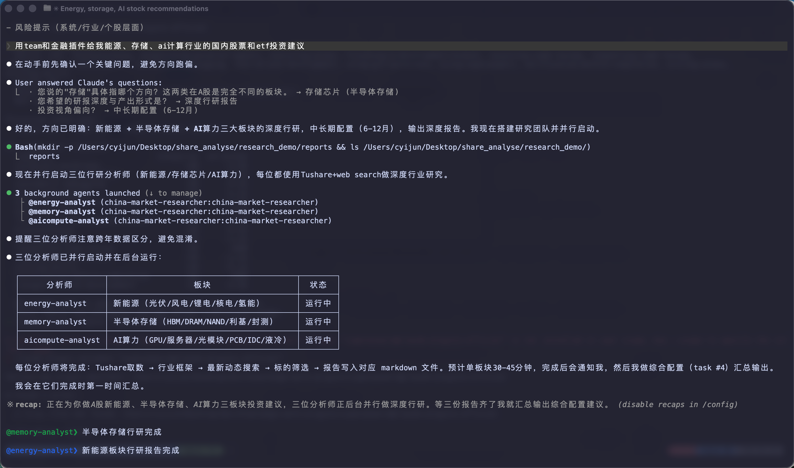
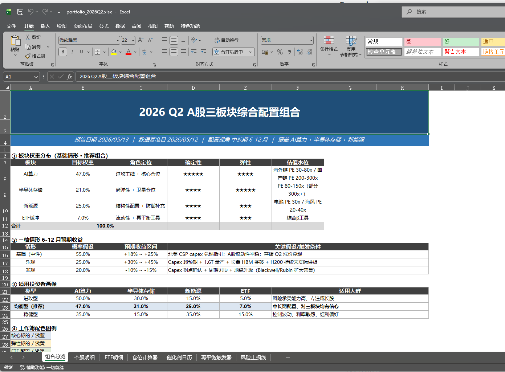
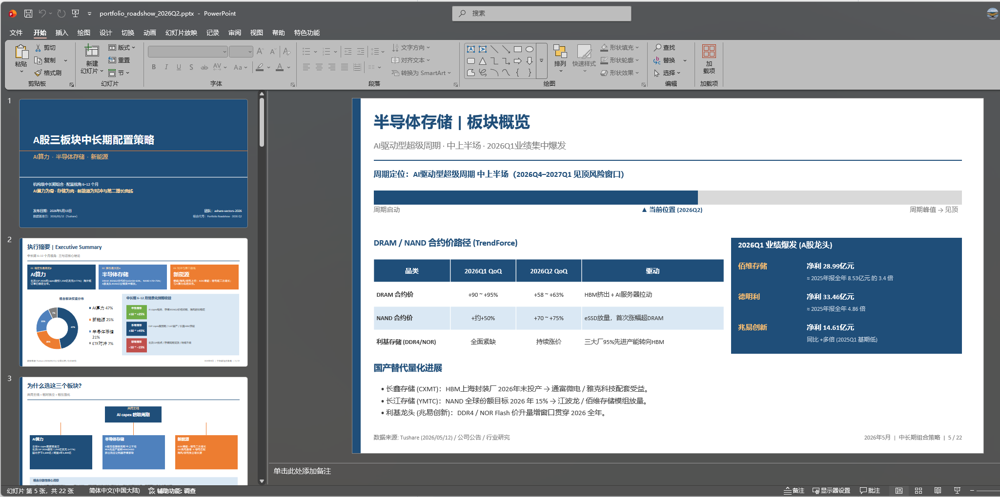

# China Financial Services

English | [中文](README.zh.md)

AI agent plugins and managed-agent templates for China A-share market research, powered by [Tushare](https://tushare.pro/).

> **Important:** Nothing in this repository constitutes investment, legal, tax, or accounting advice. These agents draft analyst work product for review by a qualified professional. They do not make investment recommendations, execute transactions, or bind risk. Every output is staged for human sign-off.

## What's included

| Agent | Description | Output |
|---|---|---|
| **china-market-researcher** | Sector/theme → industry overview → competitive landscape → peer comps → ideas shortlist | Research note or slides |
| **china-model-builder** | DCF, trading comps, 3-statement model for A-share companies | Excel workbook |

| Vertical Plugin | Skills | Description |
|---|---|---|
| **financial-analysis** | `tushare-data`, `china-dcf-model`, `china-comps-analysis`, `china-macro-overview` | Core financial modeling and macro data tools |
| **equity-research** | `china-initiating-coverage` | Initiating coverage reports for China A-share |

## Repository Structure

```
plugins/
  agent-plugins/
    china-market-researcher/      # End-to-end workflow agent + bundled skills
    china-model-builder/
  vertical-plugins/
    financial-analysis/           # Skills (source of truth)
    equity-research/
managed-agent-cookbooks/
  china-market-researcher/        # Deploy manifest for POST /v1/agents
  china-model-builder/
scripts/
  check.py                        # Lint and verify all manifests
  sync-agent-skills.py            # Sync bundled skills from vertical sources
  sync-hooks.py                   # Sync year-guard hooks to all plugins
  deploy-managed-agent.sh         # Deploy a cookbook to CMA
  test-cookbooks.sh               # Dry-run all cookbooks
  validate.py                     # Output-schema validation helper
  orchestrate.py                  # Reference event-loop for cross-agent handoffs
```

## Examples

Sample outputs generated by the agents are available in [`out/`](out/).

### CLI Usage



### Deliverables

**Excel workbook** ([`portfolio_2026Q2.xlsx`](out/portfolio_2026Q2.xlsx)) — generated by `china-model-builder`:



**Slide deck** ([`portfolio_roadshow_2026Q2.pptx`](out/portfolio_roadshow_2026Q2.pptx)) — generated by `china-market-researcher`:



## Installation

### Kimi Code (CLI)

#### Option A: Add this repository as a plugin marketplace

Add the repo URL in Kimi Code plugin settings, then install the plugins you want:

```bash
/plugins install financial-analysis
/plugins install equity-research
/plugins install china-market-researcher
/plugins install china-model-builder
```

#### Option B: Install from local directories

```bash
/plugins install ./plugins/vertical-plugins/financial-analysis
/plugins install ./plugins/vertical-plugins/equity-research
/plugins install ./plugins/agent-plugins/china-market-researcher
/plugins install ./plugins/agent-plugins/china-model-builder
```

Then run `/plugins info <plugin-name>` to verify, and `/reload` to activate.

Agent plugins (`china-market-researcher`, `china-model-builder`) will start their workflow automatically via `sessionStart.skill` once loaded.

### Claude Code (CLI)

```bash
claude plugin marketplace add cyijun/china-financial-services
claude plugin install china-market-researcher@china-financial-services
claude plugin install china-model-builder@china-financial-services
```

### Claude Cowork (Desktop / Web)

Paste the repo URL in **Settings → Plugins → Add plugin**, or zip any directory under `plugins/` and upload it.

### Managed Agents (API)

> Currently uses the Claude Managed Agents API. Equivalent Kimi deployment support may be added later.

```bash
export ANTHROPIC_API_KEY=sk-ant-...
scripts/deploy-managed-agent.sh china-market-researcher
```

Requires `jq`, `zip`, `curl`, and `python3 + pyyaml`.

## Development

```bash
# Lint everything (CI gate)
python3 scripts/check.py

# After editing a skill in vertical-plugins/, sync to agent bundles
python3 scripts/sync-agent-skills.py

# After editing hooks in financial-analysis/, sync to all plugins
python3 scripts/sync-hooks.py

# Dry-run all cookbooks (CI gate)
bash scripts/test-cookbooks.sh
```

## Data Sources

- **Tushare Pro** — primary structured data (financial statements, valuations, macro data)
- **Web search** — industry reports, policy interpretation, news
- **Company announcements** — audited figures and qualitative details

## Credits

This project is adapted from the [Anthropic Financial Services cookbook](https://github.com/anthropics/financial-services), which provides the underlying plugin architecture, managed-agent patterns, and agent integration framework used here.

## License

See [LICENSE](LICENSE).
