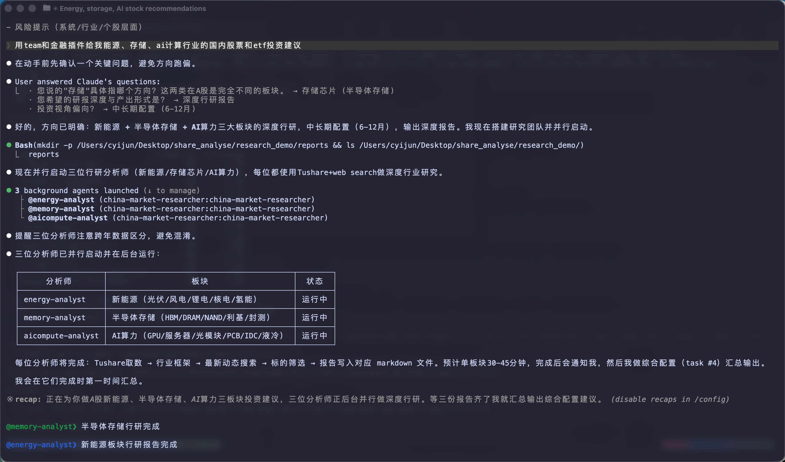

# 中国金融服务

[English](README.md) | 中文

面向中国A股市场研究、可由Codex、Claude Code和Kimi加载的Skill/插件，主数据源为[Tushare](https://tushare.pro/)，AKShare仅作受控补充。

> **重要声明：** 本仓库中的任何内容均不构成投资、法律、税务或会计建议。这些智能体仅起草分析师工作底稿，供合格专业人士审阅。它们不提供投资建议、不执行交易、不承担风险。所有输出均需经人工确认后方可使用。

## 包含内容

| 智能体 | 说明 | 输出 |
|---|---|---|
| **china-market-researcher** | 行业/主题 → 行业概览 → 竞争格局 → 可比公司估值 → 投资点子筛选 | 研究纪要或幻灯片 |
| **china-model-builder** | A 股公司 DCF、可比分析、三表预测模型 | Excel 工作簿 |

| 垂直插件 | Skills | 说明 |
|---|---|---|
| **financial-analysis** | `tushare-data`、`china-dcf-model`、`china-comps-analysis`、`3-statement-model`、`audit-xls`、`china-macro-overview` | 核心财务建模、审计与宏观工具；Claude声明方法论依赖 |
| **equity-research** | `china-initiating-coverage` | 中国 A 股首次覆盖报告 |
| **china-research-methodology** | `china-market-data` + 8个方法Skill | 6000积分Tushare主源、AKShare受控降级、PIT证据链、财务取证、估值、论点、因子验证与红队 |

## 仓库结构

```
plugins/
  agent-plugins/
    china-market-researcher/      # 端到端工作流智能体 + 打包 skills
    china-model-builder/
  vertical-plugins/
    financial-analysis/           # Skills（唯一数据源）
    equity-research/
    china-research-methodology/   # 证据优先的方法论与中国数据路由
scripts/
  check.py                        # 校验所有清单
  sync-agent-skills.py            # 将 vertical skills 同步到 agent 包
  preflight.py                    # 检查Python、运行时与凭证就绪状态
  tushare_live_acceptance.py      # 脱敏、只读的真实接口验收
  akshare_live_acceptance.py      # AKShare全声明路由的脱敏只读验收
```

## 示例

仓库保留了版本化示例产物，位于[`out/`](out/)：



- [`portfolio_2026Q2.xlsx`](out/portfolio_2026Q2.xlsx)及其[渲染预览](out/excel_report.png)
- [`portfolio_roadshow_2026Q2.pptx`](out/portfolio_roadshow_2026Q2.pptx)及其[渲染预览](out/ppt_report.png)

## 安装

### Codex（CLI / 桌面端）

仓库的5个子插件均提供原生`.codex-plugin/plugin.json`，可将GitHub仓库注册为Marketplace后按需添加。以下命令已按`codex-cli 0.149.0`的本机帮助核对；本项目不会替你安装插件。

```bash
codex plugin marketplace add cyijun/china-financial-services --ref main
codex plugin add china-research-methodology@china-financial-services
codex plugin add financial-analysis@china-financial-services
codex plugin add equity-research@china-financial-services
```

两个自包含工作流包也可单独添加：

```bash
codex plugin add china-market-researcher@china-financial-services
codex plugin add china-model-builder@china-financial-services
```

Codex会加载各插件的`skills/`。Agent插件以自包含Skill工作流运行；本仓库明确不包含远程Agent部署能力，也不包含command hooks。纵向插件请按`china-research-methodology` → `financial-analysis` → `equity-research`顺序添加。

### Kimi Code（CLI）

若不安装、只在当前会话加载，Kimi Code CLI 0.33.0提供可重复的`--skills-dir`参数：

```bash
kimi --skills-dir ./plugins/vertical-plugins/china-research-methodology/skills \
  --skills-dir ./plugins/vertical-plugins/financial-analysis/skills
kimi --skills-dir ./plugins/agent-plugins/china-market-researcher/skills
```

Kimi交互式TUI也支持持久化的`/plugins install <path-or-url>`，并识别`.kimi-plugin/plugin.json`；本仓库不会替你执行安装。安装仓库根目录只会加载目录Skill，两个Agent插件则各自内置工作流引用的全部Skill，可独立加载。

### Claude Code（CLI）

自动解析本仓库内插件依赖需要Claude Code 2.1.110或更高版本；旧版本请按`china-research-methodology` → `financial-analysis` → `equity-research`顺序手动安装。

```bash
claude plugin marketplace add cyijun/china-financial-services
claude plugin install china-market-researcher@china-financial-services
claude plugin install china-model-builder@china-financial-services
claude plugin install china-research-methodology@china-financial-services
```

### Claude Cowork（桌面端 / 网页版）

在 **设置 → 插件 → 添加插件** 中粘贴仓库 URL，或压缩 `plugins/` 下任意目录后上传。

## 开发

```bash
# 校验所有内容（CI 门禁）
python3 scripts/check.py

# 修改 vertical-plugins/ 中的 skill 后，同步到 agent 包
python3 scripts/sync-agent-skills.py

# 全部离线测试（无需SDK、Token或网络）
python3 -m unittest discover -v tests
```

GitHub Actions中的`repository-gates`负责离线测试、结构门禁和一次性Runner上的宿主加载验证；`tushare-live-acceptance`与`akshare-live-acceptance`均为手动触发、只读并上传脱敏JSON证据。真实验收与离线通过分开报告。

## 数据来源

- **Tushare Pro** — 主要结构化数据；6000积分用于规划VIP财务截面和同花顺板块能力，真实权限仍按接口返回验证
- **AKShare** — 补充公开网页行情、当前列表和交叉核对；无历史可得时点时不用于严格PIT回测
- **网页搜索** — 行业报告、政策解读、新闻
- **公司公告** — 经审计的数据及定性信息

## 致谢

本项目借鉴[Anthropic Financial Services cookbook](https://github.com/anthropics/financial-services)的插件与Skill架构；方法论来源、上游精确版本和修改边界见[`PROVENANCE.md`](PROVENANCE.md)与[`NOTICE`](NOTICE)。

## 许可证

见 [LICENSE](LICENSE)。
