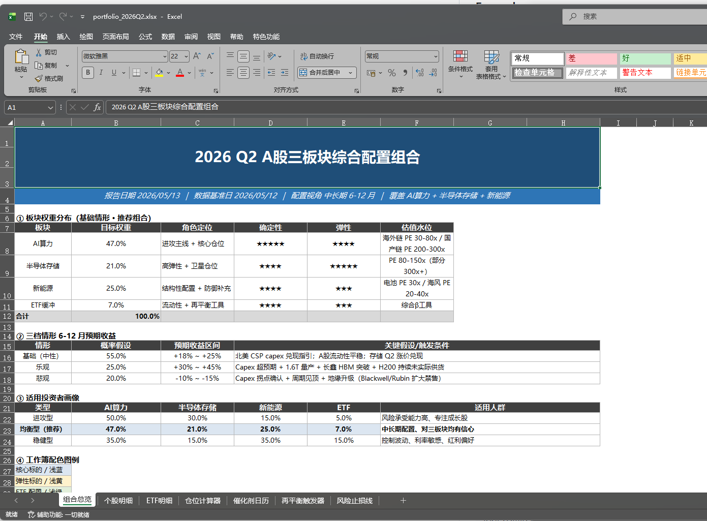
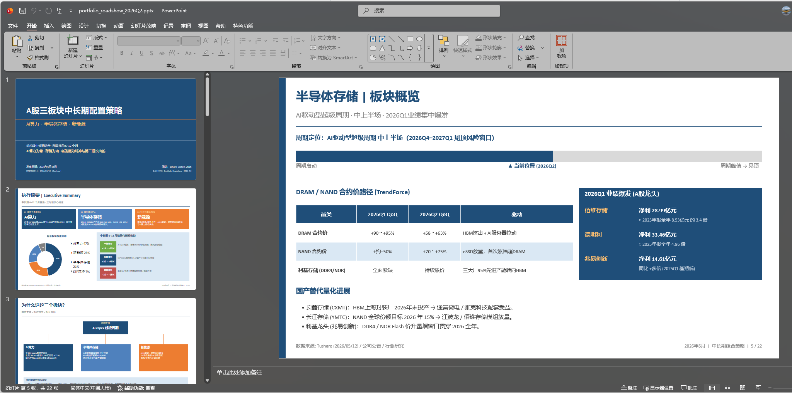

# 中国金融服务

[English](README.md) | 中文

面向中国 A 股市场研究的 AI 智能体插件与管理代理模板，基于 [Tushare](https://tushare.pro/) 数据驱动。

> **重要声明：** 本仓库中的任何内容均不构成投资、法律、税务或会计建议。这些智能体仅起草分析师工作底稿，供合格专业人士审阅。它们不提供投资建议、不执行交易、不承担风险。所有输出均需经人工确认后方可使用。

## 包含内容

| 智能体 | 说明 | 输出 |
|---|---|---|
| **china-market-researcher** | 行业/主题 → 行业概览 → 竞争格局 → 可比公司估值 → 投资点子筛选 | 研究纪要或幻灯片 |
| **china-model-builder** | A 股公司 DCF、可比分析、三表预测模型 | Excel 工作簿 |

| 垂直插件 | Skills | 说明 |
|---|---|---|
| **financial-analysis** | `tushare-data`、`china-dcf-model`、`china-comps-analysis`、`3-statement-model`、`audit-xls`、`china-macro-overview` | 核心财务建模、审计与宏观工具；Claude声明方法论依赖 |
| **equity-research** | `china-initiating-coverage` | 中国 A 股首次覆盖报告 |
| **china-research-methodology** | `china-market-data` + 8个方法Skill | 6000积分Tushare主源、AKShare受控降级、PIT证据链、财务取证、估值、论点、因子验证与红队 |

## 仓库结构

```
plugins/
  agent-plugins/
    china-market-researcher/      # 端到端工作流智能体 + 打包 skills
    china-model-builder/
  vertical-plugins/
    financial-analysis/           # Skills（唯一数据源）
    equity-research/
    china-research-methodology/   # 证据优先的方法论与中国数据路由
managed-agent-cookbooks/
  china-market-researcher/        # 部署清单，用于 POST /v1/agents
  china-model-builder/
scripts/
  check.py                        # 校验所有清单
  sync-agent-skills.py            # 将 vertical skills 同步到 agent 包
  sync-hooks.py                   # 将年份校验 hooks 同步到所有插件
  deploy-managed-agent.sh         # 将 cookbook 部署到 CMA
  test-cookbooks.sh               # 所有 cookbook 的干跑验证
  validate.py                     # 输出 schema 校验辅助
  orchestrate.py                  # 跨智能体交接的参考事件循环
```

## 示例

智能体生成的示例输出见 [`out/`](out/)。

### 命令行使用


### 交付物

**Excel 工作簿**（[`portfolio_2026Q2.xlsx`](out/portfolio_2026Q2.xlsx)）——由 `china-model-builder` 生成：



**幻灯片**（[`portfolio_roadshow_2026Q2.pptx`](out/portfolio_roadshow_2026Q2.pptx)）——由 `china-market-researcher` 生成：



## 安装

### Codex（CLI / 桌面端）

仓库的5个子插件均提供原生`.codex-plugin/plugin.json`，可将GitHub仓库注册为Marketplace后按需添加。以下命令已按`codex-cli 0.149.0`的本机帮助核对；本项目不会替你安装插件。

```bash
codex plugin marketplace add cyijun/china-financial-services --ref main
codex plugin add china-research-methodology@china-financial-services
codex plugin add financial-analysis@china-financial-services
codex plugin add equity-research@china-financial-services
```

两个自包含工作流包也可单独添加：

```bash
codex plugin add china-market-researcher@china-financial-services
codex plugin add china-model-builder@china-financial-services
```

Codex会加载各插件的`skills/`。Claude专用的Managed Agents部署脚本与hooks不属于Codex运行时；Agent插件在Codex中以自包含Skill工作流运行。纵向插件请按`china-research-methodology` → `financial-analysis` → `equity-research`顺序添加。

### Kimi Code（CLI）

#### 方式 A：将本仓库作为插件安装

添加 `https://github.com/cyijun/china-financial-services` 作为插件源。Kimi 会读取仓库根目录清单并安装一个**目录入口**；它只介绍子插件，不会递归加载或直接路由子插件Skill。

```bash
/plugins install https://github.com/cyijun/china-financial-services
```

#### 方式 B：从本地目录安装独立子插件

```bash
/plugins install ./plugins/vertical-plugins/financial-analysis
/plugins install ./plugins/vertical-plugins/equity-research
/plugins install ./plugins/vertical-plugins/china-research-methodology
/plugins install ./plugins/agent-plugins/china-market-researcher
/plugins install ./plugins/agent-plugins/china-model-builder
```

然后运行 `/plugins info <plugin-name>` 验证，并运行 `/reload` 激活。

Kimi下请先安装`china-research-methodology`，再安装依赖它的`financial-analysis`；`equity-research`还依赖`financial-analysis`。两个Agent插件已自带其工作流所需Skill副本。

智能体插件（`china-market-researcher`、`china-model-builder`）加载后会通过 `sessionStart.skill` 自动启动工作流。

### Claude Code（CLI）

自动解析本仓库内插件依赖需要Claude Code 2.1.110或更高版本；旧版本请按`china-research-methodology` → `financial-analysis` → `equity-research`顺序手动安装。

```bash
claude plugin marketplace add cyijun/china-financial-services
claude plugin install china-market-researcher@china-financial-services
claude plugin install china-model-builder@china-financial-services
claude plugin install china-research-methodology@china-financial-services
```

### Claude Cowork（桌面端 / 网页版）

在 **设置 → 插件 → 添加插件** 中粘贴仓库 URL，或压缩 `plugins/` 下任意目录后上传。

### 托管智能体（API）

> 当前使用 Claude Managed Agents API。后续可能增加同等的 Kimi 部署支持。

```bash
export ANTHROPIC_API_KEY=sk-ant-...
scripts/deploy-managed-agent.sh china-market-researcher
```

需要 `jq`、`zip`、`curl`，以及`python3 + pyyaml`或`ruby + psych`之一。

## 开发

```bash
# 校验所有内容（CI 门禁）
python3 scripts/check.py

# 修改 vertical-plugins/ 中的 skill 后，同步到 agent 包
python3 scripts/sync-agent-skills.py

# 修改 financial-analysis/ 中的 hooks 后，同步到所有插件
python3 scripts/sync-hooks.py

# 所有 cookbook 干跑验证（CI 门禁）
bash scripts/test-cookbooks.sh

# 数据路由与PIT离线测试（无需SDK、Token或网络）
python3 -m unittest -v tests.test_china_market_data
```

## 数据来源

- **Tushare Pro** — 主要结构化数据；6000积分用于规划VIP财务截面和同花顺板块能力，真实权限仍按接口返回验证
- **AKShare** — 补充公开网页行情、当前列表和交叉核对；无历史可得时点时不用于严格PIT回测
- **网页搜索** — 行业报告、政策解读、新闻
- **公司公告** — 经审计的数据及定性信息

## 致谢

本项目改编自 [Anthropic Financial Services cookbook](https://github.com/anthropics/financial-services)，其提供了此处使用的底层插件架构、管理代理模式及智能体集成框架。

## 许可证

见 [LICENSE](LICENSE)。
